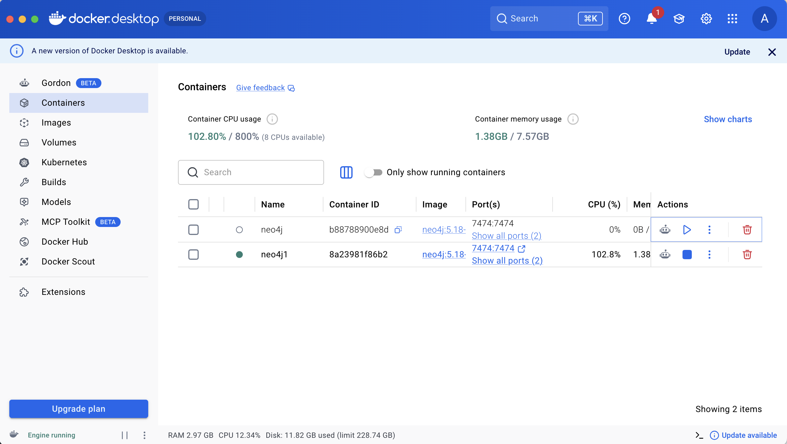
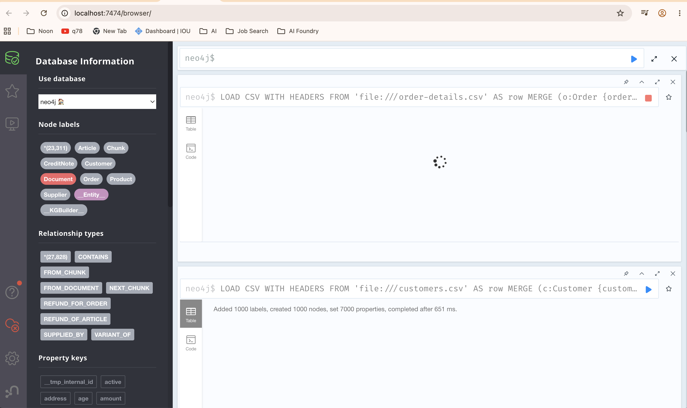

# Customer Graph — GraphRAG Setup Guide

> **Base repository:** https://github.com/neo4j-product-examples/graphrag-examples/tree/main/customer-graph
>
> This guide adapts the original tutorial to run on **Neo4j Community Edition via Docker** instead of AuraDB Professional. All code changes required to make this work are documented in [`CODE_CHANGES.md`](./CODE_CHANGES.md).

---

## What This Project Does

Builds a GraphRAG (Graph Retrieval-Augmented Generation) system over a fashion retail dataset by combining:

- **Unstructured data** — PDFs (fashion catalog, credit notes) extracted into a knowledge graph using LLM entity extraction
- **Structured data** — CSV files (customers, orders, articles, products, suppliers) imported as graph nodes and relationships
- **Vector embeddings** — Product descriptions embedded with OpenAI for semantic search
- **Agentic Q&A** — A Semantic Kernel agent that answers natural language questions by traversing the graph

---

## Why Docker Community Instead of AuraDB

The original tutorial uses **AuraDB Professional** which provides:
- Aura Importer (GUI-based CSV-to-graph tool)
- GenAI plugin for in-database vector embedding
- Graph Data Science (GDS) plugin

We replace all of this with:
- **Manual `LOAD CSV` Cypher queries** instead of Aura Importer
- **Python + OpenAI batched API calls** instead of GenAI plugin
- **`graph-data-science` Docker plugin** for community GDS support

---

## Prerequisites

- Python 3.13+
- Docker Desktop installed and running
- OpenAI API key
- Git

---

## Step 1 — Clone the Repository

```bash
git clone https://github.com/neo4j-product-examples/graphrag-examples.git
cd graphrag-examples/customer-graph
```

---

## Step 2 — Create Python Virtual Environment

```bash

brew unlink python@3.14
brew link --overwrite python@3.13

python3 -m venv venv
source venv/bin/activate   # Mac/Linux

cd customer-graph
pip install -r requirements.txt
```

---

## Step 3 — Configure Environment Variables

```bash
cp .env.example .env
```

Edit `.env` with your credentials:

```env
NEO4J_URI=bolt://localhost:7687
NEO4J_USERNAME=neo4j
NEO4J_PASSWORD=password123
OPENAI_API_KEY=sk-...
```

---

## Step 4 — Start Neo4j via Docker

Instead of AuraDB, run Neo4j Community Edition locally. This single command sets up Neo4j with all required plugins (APOC, APOC Extended, Graph Data Science) and creates named volumes so your data persists across container restarts:

```bash
docker run -d \
  --name neo4j \
  -p 7474:7474 \
  -p 7687:7687 \
  -e NEO4J_AUTH=neo4j/password123 \
  -e NEO4J_PLUGINS='["apoc", "apoc-extended", "graph-data-science"]' \
  -e NEO4J_dbms_security_procedures_unrestricted='apoc.*,genai.*,gds.*' \
  -e NEO4J_dbms_security_procedures_allowlist='apoc.*,genai.*,gds.*' \
  -e NEO4J_dbms_default__listen__address=0.0.0.0 \
  -e NEO4J_dbms_default__advertised__address=localhost \
  -v docker_neo4j_data:/data \
  -v docker_neo4j_logs:/logs \
  neo4j:5.18-community
```



Wait ~30 seconds for startup, then open Neo4j Browser at **http://localhost:7474**
Login: `neo4j` / `password123`

Verify plugins loaded:
```cypher
RETURN gds.version()
```



> **Note:** The `genai` plugin is not available on Neo4j 5.18 Community. We handle embeddings in Python instead — see Step 9.

---

## Step 5 — Apply Code Fixes

The `neo4j-graphrag` library has breaking API changes since the original tutorial was written. Before running any scripts, apply all fixes documented in [`CODE_CHANGES.md`](./CODE_CHANGES.md).

Files to update:
- `rag_schema_from_onto.py` — renamed schema classes
- `unstructured_ingest.py` — deprecated imports + pass schema directly
- `ingest_post_processing.py` — replace genai plugin with Python embeddings
- `graphrag/retail_service.py` — fix relationship paths + add missing methods
- `graphrag/retail_plugin.py` — expose new agent tool

---

## Step 6 — Run Unstructured PDF Ingestion

This reads the PDFs (`data/credit-notes.pdf`, `data/fashion-catalog.pdf`), uses the ontology in `ontos/customer.ttl` to guide LLM entity extraction, and writes a knowledge graph to Neo4j:

```bash
python unstructured_ingest.py
```

This takes several minutes. When complete, verify in Neo4j Browser:

```cypher
MATCH (n) RETURN labels(n), count(n) ORDER BY count(n) DESC
```

You should see nodes tagged `__KGBuilder__` and `__Entity__` with labels like `CreditNote`, `Order`, `Article`, `Product`.

---

## Step 7 — Import Structured CSV Data

The original tutorial uses **Aura Importer** (AuraDB-only GUI tool). We replace it with `LOAD CSV` Cypher queries.

### 7a — Copy CSVs into the Docker Container

```bash
for f in data/articles.csv data/customers.csv data/order-details.csv data/suppliers.csv data/products.csv; do
    docker cp $f neo4j:/var/lib/neo4j/import/
done
```

Verify files are inside the container:

```bash
docker exec neo4j ls /var/lib/neo4j/import/
```

### 7b — Run LOAD CSV Queries in Neo4j Browser

Run each block **one at a time, in this exact order**:

**1. Suppliers**
```cypher
LOAD CSV WITH HEADERS FROM 'file:///suppliers.csv' AS row
MERGE (s:Supplier {supplierId: row.supplierId})
SET s.name = row.supplierName,
    s.address = row.supplierAddress;
```

**2. Products**
```cypher
LOAD CSV WITH HEADERS FROM 'file:///products.csv' AS row
MERGE (p:Product {productCode: row.productCode})
SET p.name = row.prodName,
    p.productTypeNo = row.productTypeNo,
    p.productTypeName = row.productTypeName,
    p.productGroupName = row.productGroupName,
    p.garmentGroupNo = row.garmentGroupNo,
    p.garmentGroupName = row.garmentGroupName,
    p.description = row.detailDesc;
```

**3. Articles** (links to Products and Suppliers)
```cypher
LOAD CSV WITH HEADERS FROM 'file:///articles.csv' AS row
MERGE (a:Article {articleId: row.articleId})
SET a.productCode = row.productCode,
    a.name = row.prodName,
    a.productTypeName = row.productTypeName,
    a.graphicalAppearanceNo = row.graphicalAppearanceNo,
    a.graphicalAppearanceName = row.graphicalAppearanceName,
    a.colourGroupCode = row.colourGroupCode,
    a.colourGroupName = row.colourGroupName
WITH a, row
MATCH (p:Product {productCode: row.productCode})
MERGE (a)-[:VARIANT_OF]->(p)
WITH a, row
MATCH (s:Supplier {supplierId: row.supplierId})
MERGE (a)-[:SUPPLIED_BY]->(s);
```

**4. Customers**
```cypher
LOAD CSV WITH HEADERS FROM 'file:///customers.csv' AS row
MERGE (c:Customer {customerId: row.customerId})
SET c.firstName = row.fn,
    c.active = row.active,
    c.clubMemberStatus = row.clubMemberStatus,
    c.fashionNewsFrequency = row.fashionNewsFrequency,
    c.age = toInteger(row.age),
    c.postalCode = row.postalCode;
```

**5. Orders, Transactions and Relationships**

> ⚠️ **Important:** Use `toInteger(row.orderId)` — this is critical for linking with PDF-extracted entities in the next step.

```cypher
LOAD CSV WITH HEADERS FROM 'file:///order-details.csv' AS row
MERGE (o:Order {orderId: toInteger(row.orderId)})
WITH o, row
MERGE (t:Transaction {txId: row.txId})
SET t.date = row.tDat,
    t.price = toFloat(row.price),
    t.salesChannelId = row.salesChannelId
MERGE (o)-[:HAS_TRANSACTION]->(t)
WITH o, t, row
MATCH (c:Customer {customerId: row.customerId})
MERGE (c)-[:PLACED]->(o)
WITH o, t, row
MATCH (a:Article {articleId: row.articleId})
MERGE (t)-[:CONTAINS]->(a);
```

---

## Step 8 — Create Cross-Links Between Structured and Unstructured Data

The LLM extracts `orderId` and `articleId` as integers from PDFs, but `LOAD CSV` imports them as strings by default. This causes joins between structured (CSV) and unstructured (PDF) nodes to silently fail. Run these three queries in Neo4j Browser to fix the types and create the cross-links:

**Fix Article ID type (string → integer):**
```cypher
MATCH (a:Article) WHERE NOT '__KGBuilder__' IN labels(a)
SET a.articleId = toInteger(a.articleId)
```

**Link CreditNotes to structured Articles:**
```cypher
MATCH (c:CreditNote)-[:REFUND_OF_ARTICLE]->(a1:Article)
WHERE '__KGBuilder__' IN labels(a1)
MATCH (a2:Article) WHERE NOT '__KGBuilder__' IN labels(a2)
AND a2.articleId = a1.articleId
MERGE (c)-[:REFUND_OF_ARTICLE_STRUCTURED]->(a2)
```

**Link CreditNotes to Suppliers via the Order chain:**
```cypher
MATCH (c:CreditNote)-[:REFUND_FOR_ORDER]->(o1:Order)
MATCH (o2:Order)-[:HAS_TRANSACTION]->(t:Transaction)-[:CONTAINS]->(a:Article)-[:SUPPLIED_BY]->(s:Supplier)
WHERE o1.orderId = o2.orderId
MERGE (c)-[:RETURNED_TO_SUPPLIER]->(s)
```

Verify both links were created:
```cypher
MATCH (c:CreditNote)-[:REFUND_OF_ARTICLE_STRUCTURED]->(a) RETURN count(*) AS articleLinks
```
```cypher
MATCH (c:CreditNote)-[:RETURNED_TO_SUPPLIER]->(s) RETURN count(*) AS supplierLinks
```

Both should return values greater than 0.

---

## Step 9 — Run Post-Processing (Embeddings + Vector Index)

The original tutorial uses the `genai.vector.encodeBatch` Neo4j procedure (not available on Community 5.18). The updated `ingest_post_processing.py` generates embeddings directly via the OpenAI Python SDK in batches of 500:

```bash
python ingest_post_processing.py
```

Expected output:
```
Formatting Product Text
Creating Product Text Embeddings
  Found 8018 products to embed
  Embedded 500/8018 products
  Embedded 1000/8018 products
  ...
  Embedded 8018/8018 products
Creating Product Vector Index
Waiting for vector index to come online...
Done.
```

---

## Step 10 — Run the Agent

```bash
cd graphrag
python cli_agent.py
```

The agent uses Semantic Kernel with OpenAI `gpt-4o-mini` and has access to these tools:
- **`search_products`** — semantic vector search over product descriptions
- **`recommend_products`** — graph-based collaborative filtering
- **`create_customer_segments`** — GDS Leiden community detection
- **`get_product_order_supplier_info`** — order and return stats by product
- **`get_supplier_order_product_info`** — order and return stats by supplier
- **`get_top_suppliers_by_returns`** — ranks all suppliers by credit note count
- **`answer_general_question`** — text-to-Cypher for arbitrary graph queries

### Sample Questions

```
What are some good sweaters for spring? Nothing too warm please!
```
```
Which suppliers have the highest number of returns (i.e., credit notes)?
```
```
What are the top 3 most returned products for supplier 1616? Get those product codes and find other suppliers who have less returns for each product I can use instead.
```
```
Can you run a customer segmentation analysis?
```
```
What are the most common product types purchased for each segment?
```
```
For the largest group make a creative spring promotional campaign for them highlighting recommended products. Draft it as an email.
```

---

## Troubleshooting

| Error | Cause | Fix |
|---|---|---|
| `ImportError: cannot import name 'SchemaEntity'` | Library API change | Rename to `NodeType` — see CODE_CHANGES.md |
| `ImportError: cannot import name 'SchemaConfig'` | Library API change | Rename to `GraphSchema` — see CODE_CHANGES.md |
| `ValidationError: List should have at least 1 item` | Pydantic now rejects empty properties list | Use `make_node()` helper — see CODE_CHANGES.md |
| `TypeError: missing argument 'node_types'` | `create_schema_model` params renamed | See CODE_CHANGES.md |
| `AttributeError: 'GraphSchema' has no attribute 'entities'` | Field renamed | Pass `schema=neo4j_schema` directly to `SimpleKGPipeline` |
| `ProcedureNotFound: genai.vector.encodeBatch` | GenAI plugin not on Community 5.18 | Use Python OpenAI embeddings — see CODE_CHANGES.md |
| Supplier/article returns always 0 | ID type mismatch between CSV (string) and PDF (integer) | Run Step 8 cross-link queries |
| `gds.graph.drop` not found | GDS plugin missing | Add `graph-data-science` to Docker plugins — Step 4 |
| GDS projection fails | Wrong relationship names in original code | Fix `ORDERED/CONTAINS` → `PLACED/HAS_TRANSACTION` — see CODE_CHANGES.md |
| Agent says "no supplier data available" | Missing `get_top_suppliers_by_returns` tool | Add new method — see CODE_CHANGES.md |
